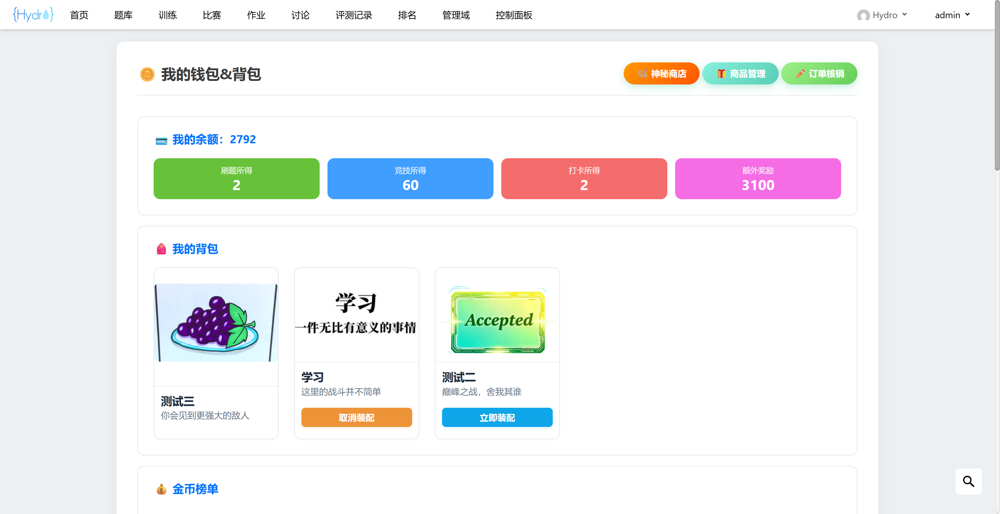
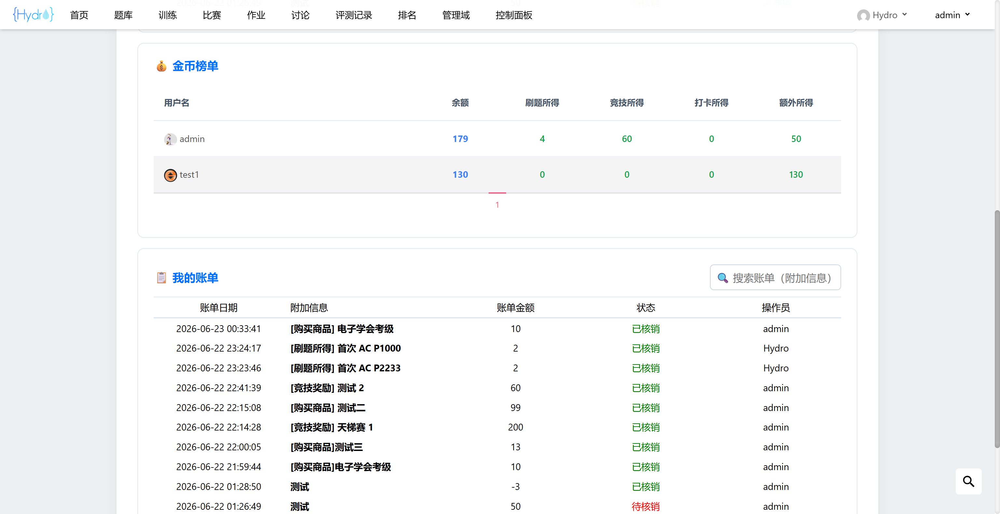
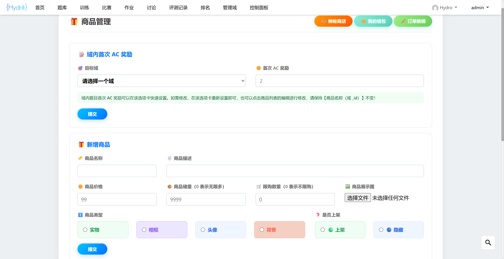
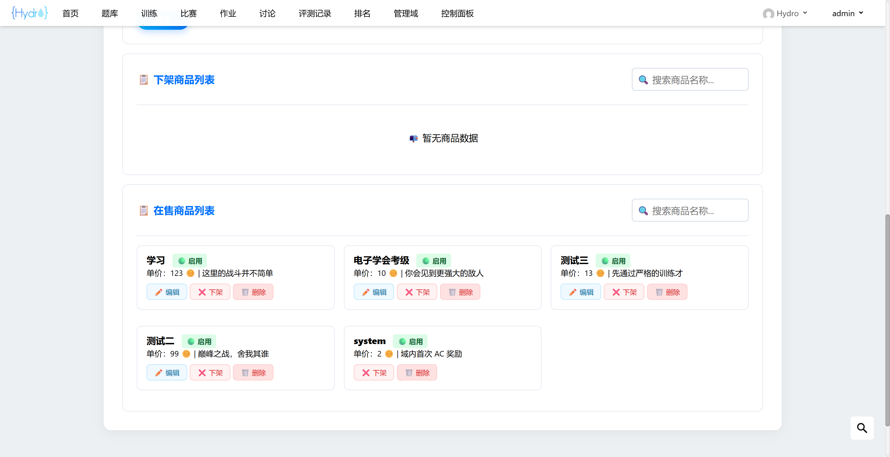
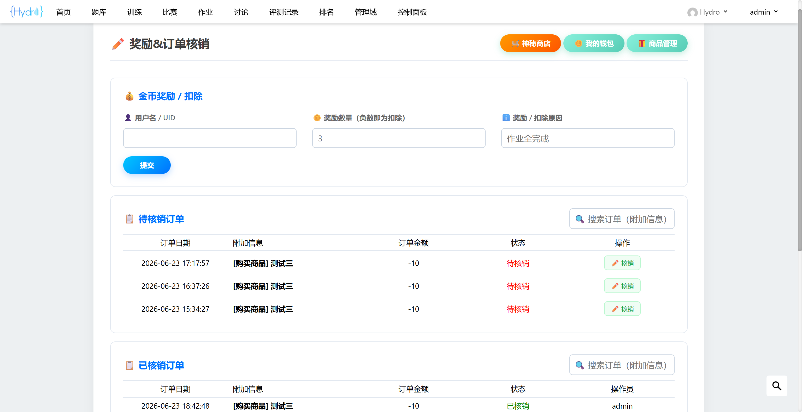
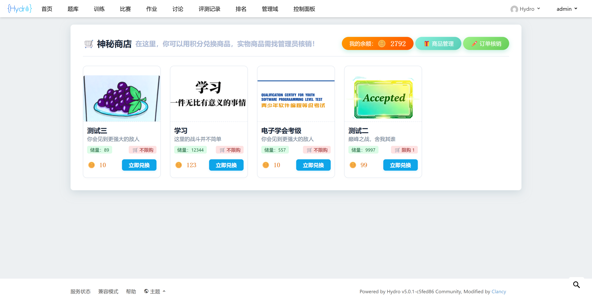

# Hydro 金币 & 商店插件

兼容 V5.0.1 社区版，不依赖任何第三方库，安装方法见官方文档。目前支持添加的商品有实物、头像、头像框、主页背景图、AC 弹窗（依赖于 `hydro-ac-alert` 插件），热力图涉及到代码修改，为内置虚拟商品，安装后自动添加。

`/img` 中是 `README.md` 的截图，安装时可以放心删除。

## 普通用户功能

1. 在管理员配置【域内首次 AC 奖励】之后，可以通过刷题获得金币。
2. 在安装 `hydro-checkin` 插件之后，可以通过每日打卡签到随机掉落 $1\sim 3$ 金币。
3. 在安装 `hydro-stages` 插件的情况下，可以通过编程竞技获得金币。
4. 可以在【神秘商店】兑换相应的商品，虚拟商品兑换后立即发放，实物商品兑换后需找管理员进行线下核销。
5. 可以从下拉菜单【钱包&背包】进入自己的背包，虚拟商品可以选择是否装配。

## 管理员功能

拥有 `PRIV_SET_PERM` 权限的用户为管理员用户。

1. 可以设置【域内首次 AC 奖励】。
2. 可以 “无理由” 奖励 / 扣除其他用户的金币。
3. 可以添加、上架、下架、修改、删除商品，支持上传商品图片。
4. 可以核销所有用户下的实物兑换订单。
5. 拥有普通用户的全部功能。

## 数据表

该插件新建四张数据表，不会向任何原生数据表添加字段，便于迁移。

- `coins`：存储所有用户的金币获得情况，没有安装 `hydro-checkin` 和 `hydro-stages` 插件的情况下 `checkin` 和 `stages` 字段为空。

|字段|类型|说明|
|:-:|:-:|:-|
|`uid`|`number`|用户 ID|
|`total`|`number`|余额|
|`problems`|`number`|刷题所得|
|`stages`|`number`|竞技所得|
|`checkin`|`number`|打卡所得|
|`bonus`|`number`|额外奖励|

- `bills`：存储所有用户的账单情况。

|字段|类型|说明|
|:-:|:-:|:-|
|`createAt`|`Date`|创建时间|
|`rootId`|`number`|操作员 ID|
|`uid`|`number`|操作对象 ID|
|`goodsId`|`string`|商品 ID|
|`coins`|`number`|金币数量|
|`content`|`string`|操作日志|
|`check`|`boolean`|核销状态|

- `goods`：存储所有商品的情况。

|字段|类型|说明|
|:-:|:-:|:-|
|`name`|`string`|商品名|
|`description`|`string`|商品简介|
|`price`|`number`|商品单价|
|`amount`|`number`|商品储量, 0 表示无穷|
|`limit`|`number`|限购数量, 0 表示不限购|
|`imageUrl`|`string`|商品展示图|
|`type`|`number`|0:实物, 1:域内首次 AC, 2:热力图, 3:头像框, 4:头像, 5:背景, 6:AC 弹窗|
|`status`|`boolean`|上架状态|
|`sale`|`number`|销量|

- `bag`：存储所有已购商品的情况。

|字段|类型|说明|
|:-:|:-:|:-|
|`uid`|`number`|用户 ID|
|`goodsId`|`string`|商品 ID|
|`type`|`number`|商品类别，用于限制同类虚拟商品装配数量|
|`loaded`|`boolean`|false:未装配, true:已装配|

## 部分截图

